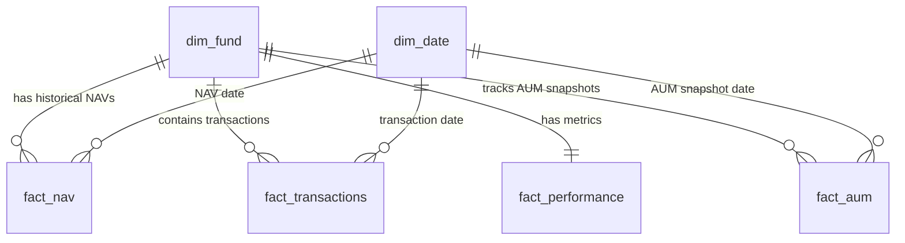

# Mutual Fund Analytics - Data Dictionary (Day 2)

This document provides a comprehensive technical and business data dictionary for the "Mutual Fund Analytics" SQLite star schema warehouse (`bluestock_mf.db`).

---

## Star Schema Overview

---

## 1. Dimension Tables

### 1.1 `dim_fund`
- **Description:** Store table for mutual fund scheme metadata.
- **Primary Source:** `scheme_performance.csv` (unique records based on AMFI code)

| Column Name | SQLite Data Type | Business Meaning | Example Value | Source Column | Notes / Constraints |
|:---|:---|:---|:---|:---|:---|
| `scheme_code` | `INTEGER` | AMFI scheme identifier | `119092` | `amfi_code` | **Primary Key**. Must be unique. |
| `fund_name` | `TEXT` | Legal name of the mutual fund scheme | `Axis Bluechip` | `fund_name` | Cannot be NULL. |
| `amc` | `TEXT` | Asset Management Company (Fund House) name | `Axis Mutual Fund` | `amc` | Cannot be NULL. |
| `category` | `TEXT` | Asset class category classification | `Large Cap` | `category` | Cannot be NULL. |
| `benchmark` | `TEXT` | Regulatory benchmark index used for comparison | `Nifty 50 TRI` | `benchmark` | Cannot be NULL. |

### 1.2 `dim_date`
- **Description:** Calendar dimension table supporting granular date intelligence (YoY, MoM, quarterly).
- **Primary Source:** Programmatically generated in `database_loader.py` covering all transaction and NAV history dates.

| Column Name | SQLite Data Type | Business Meaning | Example Value | Source Column | Notes / Constraints |
|:---|:---|:---|:---|:---|:---|
| `date` | `TEXT` | Calendar date (Format: YYYY-MM-DD) | `2026-06-22` | Generated | **Primary Key**. ISO-8601 text format. |
| `day` | `INTEGER` | Day of the month (1-31) | `22` | Generated | Constrained [1, 31]. |
| `month` | `INTEGER` | Numerical month of the year (1-12) | `6` | Generated | Constrained [1, 12]. |
| `month_name` | `TEXT` | Full name of the month | `June` | Generated | E.g. January, February, etc. |
| `quarter` | `INTEGER` | Calendar quarter (1-4) | `2` | Generated | Constrained [1, 4]. |
| `year` | `INTEGER` | Calendar year (YYYY) | `2026` | Generated | E.g. 2026. |
| `day_of_week` | `INTEGER` | Zero-indexed day of week index | `0` | Generated | 0 = Monday, 6 = Sunday. |
| `day_name` | `TEXT` | Day of the week name | `Monday` | Generated | E.g. Monday, Tuesday, etc. |
| `is_weekend` | `INTEGER` | Flag indicating Saturday or Sunday | `0` | Generated | `1` = Weekend, `0` = Weekday. |

---

## 2. Fact Tables

### 2.1 `fact_nav`
- **Description:** Fact table storing daily Net Asset Value (NAV) historical records.
- **Primary Source:** `nav_history.csv` (combined individual fund NAV CSVs)

| Column Name | SQLite Data Type | Business Meaning | Example Value | Source Column | Notes / Constraints |
|:---|:---|:---|:---|:---|:---|
| `nav_id` | `INTEGER` | Surrogate key for NAV records | `4921` | Generated | **Primary Key** (AUTOINCREMENT). |
| `scheme_code` | `INTEGER` | Reference to the fund dimension table | `119092` | `amfi_code` | **Foreign Key** referencing `dim_fund(scheme_code)`. |
| `date` | `TEXT` | Reference to the date dimension table | `2026-06-22` | `date` | **Foreign Key** referencing `dim_date(date)`. |
| `nav` | `REAL` | Net Asset Value price per unit | `6199.4871` | `nav` | Checked to be `> 0.0`. |

### 2.2 `fact_transactions`
- **Description:** Fact table recording individual investor transaction buy/sell events.
- **Primary Source:** `investor_transactions.csv`

| Column Name | SQLite Data Type | Business Meaning | Example Value | Source Column | Notes / Constraints |
|:---|:---|:---|:---|:---|:---|
| `transaction_id` | `TEXT` | Unique transactional event receipt number | `TXN10023` | `transaction_id` | **Primary Key**. |
| `scheme_code` | `INTEGER` | Reference to the fund dimension table | `119092` | `amfi_code` | **Foreign Key** referencing `dim_fund(scheme_code)`. |
| `transaction_date` | `TEXT` | Reference to the date dimension table | `2026-06-18` | `transaction_date`| **Foreign Key** referencing `dim_date(date)`. |
| `transaction_type` | `TEXT` | Classification of the trade | `SIP` | `transaction_type`| Must be either `SIP`, `Lumpsum`, or `Redemption`. |
| `amount` | `REAL` | Value of the transaction in INR | `5000.00` | `amount` | Validated `> 0.0`. |
| `units` | `REAL` | Number of mutual fund units purchased/redeemed | `80.7812` | `units` | Can be zero or positive. |
| `investor_name` | `TEXT` | Customer's full name | `Rahul Sharma` | `investor_name` | Cannot be NULL. |
| `kyc_status` | `TEXT` | Regulatory Know Your Customer verification status | `Verified` | `kyc_status` | Standardized to `Verified`, `Pending`, or `Failed`. |
| `state` | `TEXT` | Customer's home state of residence | `Maharashtra` | `state` | Used for geographical reporting. |

### 2.3 `fact_performance`
- **Description:** Fact table tracking fund return performance benchmarks and costs.
- **Primary Source:** `scheme_performance.csv`

| Column Name | SQLite Data Type | Business Meaning | Example Value | Source Column | Notes / Constraints |
|:---|:---|:---|:---|:---|:---|
| `performance_id` | `INTEGER` | Surrogate key for performance metrics | `1` | Generated | **Primary Key** (AUTOINCREMENT). |
| `scheme_code` | `INTEGER` | Reference to the fund dimension table | `119092` | `amfi_code` | **Foreign Key** referencing `dim_fund(scheme_code)`. |
| `returns_1y` | `REAL` | 1-Year historical return percentage | `12.50` | `returns_1y` | Imputed with category median if missing. |
| `returns_3y` | `REAL` | 3-Year annualized return percentage | `25.00` | `returns_3y` | Outliers clipped to realistic levels. |
| `returns_5y` | `REAL` | 5-Year annualized return percentage | `13.90` | `returns_5y` | Imputed with category median if missing. |
| `expense_ratio` | `REAL` | Percentage fee charged by the fund house | `1.20` | `expense_ratio` | Validated to fit range `[0.10%, 2.50%]`. |
| `sharpe_ratio` | `REAL` | Risk-adjusted return measure (Sharpe Ratio) | `0.95` | `sharpe_ratio` | High values imply better risk-adjusted return. |
| `sortino_ratio` | `REAL` | Downside risk-adjusted return measure | `1.08` | `sortino_ratio` | Higher is better. |

### 2.4 `fact_aum`
- **Description:** Fact table tracking mutual fund AUM values.
- **Primary Source:** `scheme_performance.csv` (snapshot value)

| Column Name | SQLite Data Type | Business Meaning | Example Value | Source Column | Notes / Constraints |
|:---|:---|:---|:---|:---|:---|
| `aum_id` | `INTEGER` | Surrogate key for AUM snapshots | `1` | Generated | **Primary Key** (AUTOINCREMENT). |
| `scheme_code` | `INTEGER` | Reference to the fund dimension table | `119092` | `amfi_code` | **Foreign Key** referencing `dim_fund(scheme_code)`. |
| `date` | `TEXT` | Reference to the date dimension table | `2026-06-22` | Generated | **Foreign Key** referencing `dim_date(date)`. |
| `aum_cr` | `REAL` | Assets Under Management in Crores (INR) | `29120.40` | `aum_cr` | Cannot be NULL. |
